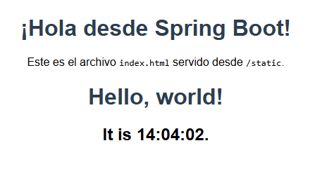

# Introducción a React-JS

Por: Luis Daniel Benavides

Fecha: 22-06-2020

En este tutorial aprenderemos a utilizar ReactJs.
A diferencia de los miles de las guías que encontrarán internet, está guía introduce
react desde un punto de vista de Arquitectura.
En la guía utilizaremos Spring para implementar servicios Web. Nuevamente esta
decisión de usar Spring es para separar claramente la diferencia entre el código que
se realiza en el cliente y el que se realiza en el servidor. Los ejemplos de esta guía los
podría ejecutar con cualquier framework que le permita implementar servicios web,
por ejemplo con node.js.

## Creando su ambiente de trabajo

Para crear su ambiente de trabajo vamos a utilizar un controlador simple de Spring
que nos garantice que suba el servidor web y que empiece a servir código estático.

Para esto debe:

1. Crear una aplicación java básica usando maven.

   ```
   mvn archetype:generate -DarchetypeGroupId=org.apache.maven.archetypes -
   DarchetypeArtifactId=maven-archetype-quickstart -DarchetypeVersion=1.4
   ```
2. Actualizar el pom para utilizar la configuración web-MVC de spring boot. Incluya
lo siguiente en su pom.
  ```
  <dependencies>
   <dependency>
   <groupId>org.springframework.boot</groupId>
   <artifactId>spring-boot-starter-web</artifactId>
   <version>2.3.1.RELEASE</version>
   </dependency>
  </dependencies>
  ```
3. Cree la siguiente clase que iniciará el servidor de aplicaciones de Spring con la
configuración mínima Web-MVC.
  ```
  import org.springframework.boot.SpringApplication;
  import org.springframework.boot.autoconfigure.SpringBootApplication;
  import org.springframework.web.bind.annotation.GetMapping;
  import org.springframework.web.bind.annotation.RestController;
  @SpringBootApplication
  @RestController
  public class WebSiteController {
   public static void main(String[] args) {
   SpringApplication.run(WebSiteController.class, args);
   }
   @GetMapping("/status")
   public String status() {
   return "{\"status\":\"Greetings from Spring Boot. " +
   java.time.LocalDate.now() + ", " +
   java.time.LocalTime.now() +
   ". " + "The server is Runnig!\"}";
   }
  }

  ```
4. Cree un index html en la siguiente localización: /src/main/resources/static
   ```
    <!DOCTYPE html>
    <html lang="es">
    <head>
        <meta charset="UTF-8">
        <title>Bienvenido a IntroReact</title>
        <style>
            body {
                font-family: Arial, sans-serif;
                text-align: center;
                margin-top: 50px;
            }
            h1 {
                color: #2c3e50;
            }
        </style>
    </head>
    <body>
    <h1>¡Hola desde Spring Boot!</h1>
    <p>Este es el archivo <code>index.html</code> servido desde <code>/static</code>.</p>
    </body>
    </html>
   ```
5. Corra la clase que acabamos de crear y su servidor debe iniciar la ejecución.
6. Verifique que se esté ejecutando accediendo a:
   ```
   localhost:8080/status
   ```
  
  
 7. Verifique que el servidor esté entregando elementos estáticos web entrando a:
   ```
   localhost:8080/index.html
   ```


## Actualizando elementos del DOM


   
